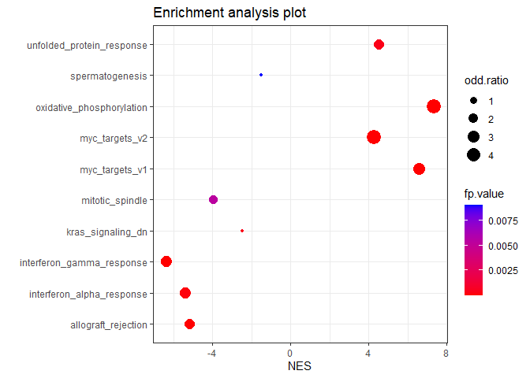

<!-- README.md is generated from README.Rmd. Please edit that file -->

# EnrichMe

<!-- badges: start -->
<!-- badges: end -->

The goal of EnrichMe is to to perform GSEA on a ranked list of objects
and set of objects as genes. The second method to test association
between gene set and ranked list of objects is to retrieve the
leading-edge subset and then perform a Fisher’s exact test. It also
gives the possibility to automatically search set of genes from
different database from the web. Finally, it gives some functions to
visualize the result of GSEA.

## Installation

You can install the development version of EnrichMe like so:

``` r
devtools::install_local("path/to/tar.gz")

#For the get_web_sets function, you need to download extra packages #from Bioconductior with the BiocManager package (already present #in the dependency) 
missing.pkgs <- c("AnnotationDbi","GO.db","ReactomePA","KEGGREST","org.Hs.eg.db","reactome.db")
BiocManager::install(missing.pkgs, update=FALSE)
```

## Example

This is a basic example which shows you how to solve a common problem:

``` r
library(EnrichMe)

data("gaf_file")
data("gmt_file")
#If you have your own set lists
sets <- read_set_gmt(gmt_file)
str(sets)
#> 'data.frame':    138 obs. of  2 variables:
#>  $ gs_name    : chr  "2-LTR circle formation" "2-LTR circle formation" "2-LTR circle formation" "2-LTR circle formation" ...
#>  $ gene_symbol: chr  "BANF1" "HMGA1" "LIG4" "PSIP1" ...
#Is using gaf format
sets <- read_set_gaf(gaf_file, "C")
#> 
#> 'select()' returned many:1 mapping between keys and columns
str(sets)
#> 'data.frame':    52 obs. of  2 variables:
#>  $ gs_name    : chr  "cytosol" "plasma membrane" "immunoglobulin complex" "plasma membrane" ...
#>  $ gene_symbol: chr  "NUDT4B" "IGKV3-7" "IGKV3-7" "IGKV1D-42" ...
#If you have no sets
sets <- get_web_sets()
#> Le chargement a nécessité le package : org.Hs.eg.db
#> Le chargement a nécessité le package : AnnotationDbi
#> Le chargement a nécessité le package : stats4
#> Le chargement a nécessité le package : BiocGenerics
#> 
#> Attachement du package : 'BiocGenerics'
#> Les objets suivants sont masqués depuis 'package:stats':
#> 
#>     IQR, mad, sd, var, xtabs
#> Les objets suivants sont masqués depuis 'package:base':
#> 
#>     anyDuplicated, aperm, append, as.data.frame, basename, cbind,
#>     colnames, dirname, do.call, duplicated, eval, evalq, Filter, Find,
#>     get, grep, grepl, intersect, is.unsorted, lapply, Map, mapply,
#>     match, mget, order, paste, pmax, pmax.int, pmin, pmin.int,
#>     Position, rank, rbind, Reduce, rownames, sapply, setdiff, sort,
#>     table, tapply, union, unique, unsplit, which.max, which.min
#> Le chargement a nécessité le package : Biobase
#> Welcome to Bioconductor
#> 
#>     Vignettes contain introductory material; view with
#>     'browseVignettes()'. To cite Bioconductor, see
#>     'citation("Biobase")', and for packages 'citation("pkgname")'.
#> Le chargement a nécessité le package : IRanges
#> Le chargement a nécessité le package : S4Vectors
#> 
#> Attachement du package : 'S4Vectors'
#> Les objets suivants sont masqués depuis 'package:base':
#> 
#>     expand.grid, I, unname
#> 
#> Attachement du package : 'IRanges'
#> L'objet suivant est masqué depuis 'package:grDevices':
#> 
#>     windows
#> 
#> 'select()' returned 1:1 mapping between keys and columns
#> 'select()' returned 1:many mapping between keys and columns
#> 'select()' returned many:1 mapping between keys and columns
#> 'select()' returned 1:1 mapping between keys and columns
str(sets)
#> List of 3
#>  $ Reactome:'data.frame':    123574 obs. of  2 variables:
#>   ..$ gs_name    : chr [1:123574] "1-diphosphate: 5-Phosphoribose" "1-diphosphate: 5-Phosphoribose" "1-diphosphate: 5-Phosphoribose" "1-diphosphate: 5-Phosphoribose" ...
#>   ..$ gene_symbol: chr [1:123574] "A1BG" "SH2B3" "KIF20A" "RASGRP1" ...
#>  $ GO      :List of 3
#>   ..$ CC:'data.frame':   106381 obs. of  2 variables:
#>   .. ..$ gs_name    : chr [1:106381] "extracellular region" "extracellular region" "extracellular region" "extracellular region" ...
#>   .. ..$ gene_symbol: chr [1:106381] "A1BG" "A1BG" "A1BG" "A2M" ...
#>   ..$ BP:'data.frame':   157247 obs. of  2 variables:
#>   .. ..$ gs_name    : chr [1:157247] "biological_process" "biological_process" "biological_process" "biological_process" ...
#>   .. ..$ gene_symbol: chr [1:157247] "A1BG" "CRYBG1" "BFSP1" "BGN" ...
#>   ..$ MF:'data.frame':   84488 obs. of  2 variables:
#>   .. ..$ gs_name    : chr [1:84488] "molecular_function" "molecular_function" "molecular_function" "molecular_function" ...
#>   .. ..$ gene_symbol: chr [1:84488] "A1BG" "AP2A2" "AIF1" "CRYBG1" ...
#>  $ KEGG    :'data.frame':    36159 obs. of  2 variables:
#>   ..$ gs_name    : chr [1:36159] "Glycolysis / Gluconeogenesis" "Glycolysis / Gluconeogenesis" "Glycolysis / Gluconeogenesis" "Glycolysis / Gluconeogenesis" ...
#>   ..$ gene_symbol: chr [1:36159] "AKR1A1" "ADH1A" "ADH1B" "ADH1C" ...

data("ranked.list")
data("fatty_acid_metabolism")
#If you want to enrich one particular set
res <- one_set_analysis(ranked.list, fatty_acid_metabolism, n.perm = 1000)
res
#> $ES.pvalue
#> [1] 0
#> 
#> $NES
#> [1] 2.570944
#> 
#> $odd.ratio
#> [1] 1.154181
#> 
#> $fp.value
#> [1] 0.4199396

#If you want to enrich multiple sets
data("pathways")
res <- multiple_set_analysis(ranked.list, pathways, n.perm = 1000)
#> Working on : adipogenesis 
#> Working on : allograft_rejection 
#> Working on : androgen_response 
#> Working on : angiogenesis 
#> Working on : apical_junction 
#> Working on : apical_surface 
#> Working on : apoptosis 
#> Working on : bile_acid_metabolism 
#> Working on : cholesterol_homeostasis 
#> Working on : coagulation 
#> Working on : complement 
#> Working on : dna_repair 
#> Working on : e2f_targets 
#> Working on : epithelial_mesenchymal_transition 
#> Working on : estrogen_response_early 
#> Working on : estrogen_response_late 
#> Working on : fatty_acid_metabolism 
#> Working on : g2m_checkpoint 
#> Working on : glycolysis 
#> Working on : hedgehog_signaling 
#> Working on : heme_metabolism 
#> Working on : hypoxia 
#> Working on : il2_stat5_signaling 
#> Working on : il6_jak_stat3_signaling 
#> Working on : inflammatory_response 
#> Working on : interferon_alpha_response 
#> Working on : interferon_gamma_response 
#> Working on : kras_signaling_dn 
#> Working on : kras_signaling_up 
#> Working on : mitotic_spindle 
#> Working on : mtorc1_signaling 
#> Working on : myc_targets_v1 
#> Working on : myc_targets_v2 
#> Working on : myogenesis 
#> Working on : notch_signaling 
#> Working on : oxidative_phosphorylation 
#> Working on : p53_pathway 
#> Working on : pancreas_beta_cells 
#> Working on : peroxisome 
#> Working on : pi3k_akt_mtor_signaling 
#> Working on : protein_secretion 
#> Working on : reactive_oxygen_species_pathway 
#> Working on : spermatogenesis 
#> Working on : tgf_beta_signaling 
#> Working on : tnfa_signaling_via_nfkb 
#> Working on : unfolded_protein_response 
#> Working on : uv_response_dn 
#> Working on : uv_response_up 
#> Working on : wnt_beta_catenin_signaling 
#> Working on : xenobiotic_metabolism
res[1:10,]
#>                        set       NES p.value odd.ratio     fp.value
#> 1             adipogenesis  4.086839   0.001 1.3703704 1.000000e+00
#> 2      allograft_rejection -5.182453   0.001 2.4289739 1.725015e-07
#> 3        androgen_response -3.874674   0.028 0.5317493 7.693671e-02
#> 4             angiogenesis -1.711296   0.080 1.2506296 1.000000e+00
#> 5          apical_junction -4.015233   0.001 1.5674215 1.105545e-01
#> 6           apical_surface -2.100034   0.001 1.3902198 1.000000e+00
#> 7                apoptosis -1.707881   0.077 0.9507728 1.000000e+00
#> 8     bile_acid_metabolism -3.239109   0.001 1.6720760 3.556853e-01
#> 9  cholesterol_homeostasis -2.700616   0.001 1.9650680 2.579215e-01
#> 10             coagulation -2.678667   0.001 1.3590254 1.000000e+00

#To visualize the multiple set analysis
dotplot(res)
```


